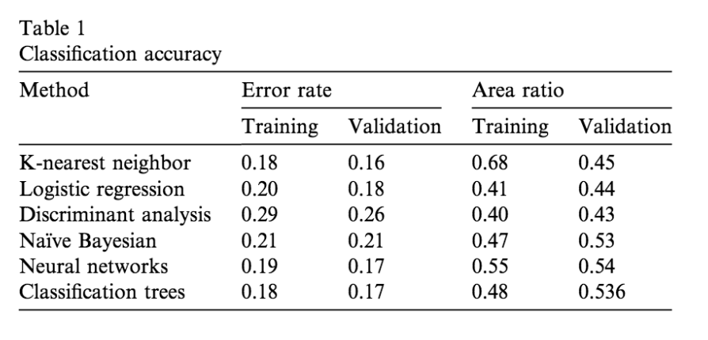

<!-- README.md is generated from README.Rmd. Please edit that file -->

```{r setup, include = FALSE}
knitr::opts_chunk$set(
  collapse = TRUE,
  comment = "#>"
)
```

# Credit Card Defaults

This project is to predict credit card defaults. The following [study](https://github.com/wangzongyan/Default-of-credit-card-clients-Data-Project/blob/master/The%20comparisons%20of%20data%20mining%20techniques%20for%20the%20predictive%20accuracy%20of%20probability%20of%20default%20of%20credit%20card%20clients.pdf) was conducted on the [dataset](https://archive.ics.uci.edu/ml/datasets/default+of+credit+card+clients):

> Yeh, I. C., & Lien, C. H. (2009). The comparisons of data mining techniques for the predictive accuracy of probability of default of credit card clients. Expert Systems with Applications, 36(2), 2473-2480

The study found the following error rates based on a validation set. My goal is to see if we can improve on these results. 

```{r echo=FALSE, out.width="500px", fig.align='center'}

```

One challenge with this dataset is the low rate of defaults:

```{r}
library(tidyverse)
library(here)
d <- read_csv(here("data", "defaults.csv"))
d %>%
  group_by(default) %>%
  summarise(count = n())
```


