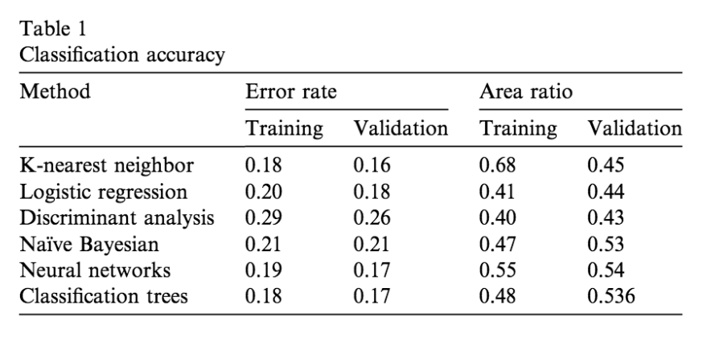

# Credit Card Defaults

This project is to predict credit card defaults. The following study was conducted on the dataset:

> Yeh, I. C., & Lien, C. H. (2009). The comparisons of data mining techniques for the predictive accuracy of probability of default of credit card clients. Expert Systems with Applications, 36(2), 2473-2480

The study found the following error rates based on a validation set. My goal is to see if we can improve on these results. 

