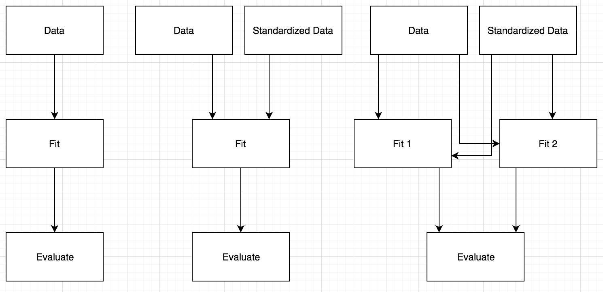

```{r setup, include=FALSE}
knitr::opts_chunk$set(echo = TRUE, warning = FALSE, message = FALSE)
```

## Credit Card Defaults

> Yeh, I. C., & Lien, C. H. (2009). The comparisons of data mining techniques for the predictive accuracy of probability of default of credit card clients. Expert Systems with Applications, 36(2), 2473-2480

```{r echo=FALSE, out.width="500px", fig.align='center'}
knitr::include_graphics("paper-error-rates.png")
```

## Exploratory Analysis

```{r echo=FALSE}
library(here)
library(tidyverse)
d <- readxl::read_xls(here("data", "default of credit card clients.xls"), 
                      skip = 1) %>%
  rename(default = `default payment next month`)
```

```{r echo=FALSE}
d %>%
  mutate_at(c("EDUCATION", "MARRIAGE"), as.factor) %>%
  group_by(EDUCATION, MARRIAGE) %>%
  summarise(prop = sum(default)/30000) %>%
  ggplot(aes(EDUCATION, prop, color = MARRIAGE)) + 
  geom_point()
```


## Results

```{r}
library(tidyverse)
library(leadr)
```

```{r error=TRUE, echo=FALSE}
paper_methods <- c("knn", "glm", "lda", "naive_bayes", "nnet", "rpart")
b <- board() %>%
  filter(model %in% paper_methods) %>%
  mutate(error = 1 - public) %>%
  select(model, error, dir)

ggplot(b, aes(fct_reorder(model, error), error, group = dir, color = dir)) +
  geom_line() +
  labs(x = NULL, y = "Error Rate", color = "Type")
```

## Comparison

```{r, echo=FALSE}
d <- tibble(
  model = c("knn", "glm", "lda", "naive_bayes", "nnet", "rpart"),
  error = c(.16, .18, .26, .21, .17, .17),
  dir = rep("paper", 6)
)

bind_rows(b, d) %>%
  filter(dir != "orig") %>% 
  ggplot(aes(fct_reorder(model, error), error, group = dir, color = dir)) +
  geom_line() +
  labs(x = NULL, y = "Error Rate", color = "Type")
```


## Improvements

```{r echo=FALSE}
board() %>%
  filter(!model %in% paper_methods) %>%
  mutate(error = 1 - public) %>%
  ggplot(aes(fct_reorder(model, error), error, group = dir, color = dir)) + 
  geom_line() + 
  labs(x = NULL, y = "Error Rate", color = "Type")
```

## Comparison

```{r echo=FALSE}
board() %>%
  mutate(error = 1 - public) %>%
  bind_rows(d) %>%
  ggplot(aes(fct_reorder(model, error), error, group = dir, color = dir)) + 
  geom_line() + 
  labs(x = NULL, y = "Error Rate", color = "Type")
```


## Model Pipeline


```{r echo=FALSE}

```

## Drake

```{r}
library(drake)
default_plan <- drake_plan(
  data = tidy_data(file_in("data/default of credit card clients.xls")),
  splits = split_data(data),
  prepped = prep_data(splits, "type__"),
  baked = bake_data(splits, prepped_type__),
  model = run(def_model, default ~ ., baked_type__$train, 
              list(model = "method__")),
  save_results(model_type___method__, "type__", baked_type__$test)
)
```

## Drake dataframe

```{r}
default_plan
```


## Wildcards 

```{r}
rules = list(type__ = "orig", method__ = "rf")
evaluate_plan(default_plan, rules = rules)
```

## More models

```{r}
rules = list(type__ = "orig", method__ = c("rf", "knn"))
evaluate_plan(default_plan, rules = rules)
```

## More data

```{r}
rules = list(type__ = c("orig", "zscore"), method__ = c("rf", "knn"))
evaluate_plan(default_plan, rules = rules)
```


