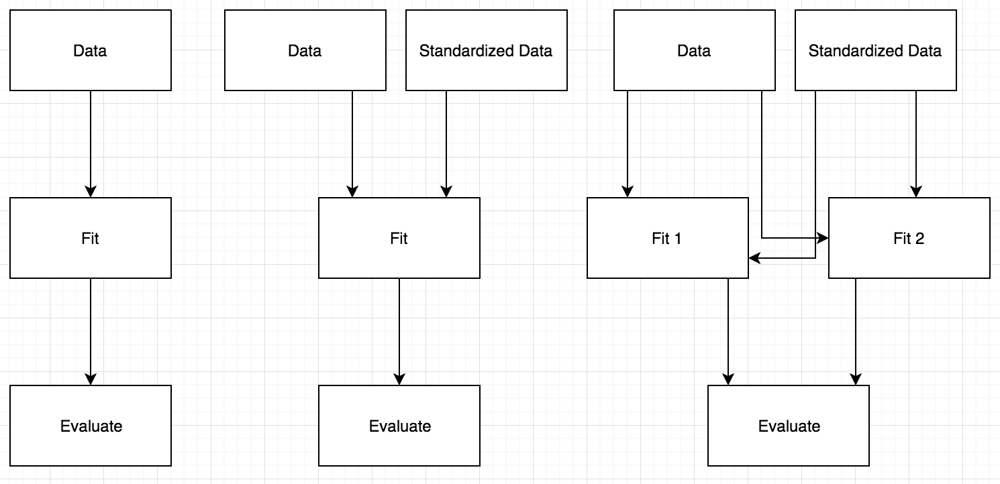

```{r setup, include=FALSE}
knitr::opts_chunk$set(echo = TRUE, warning = FALSE, message = FALSE)
```

# Credit Card Defaults

This project will study credit card defaults. This report, the data, and all the code can be found at this project's [Github repo](https://github.com/tmastny/ml-default). The following [study](https://github.com/wangzongyan/Default-of-credit-card-clients-Data-Project/blob/master/The%20comparisons%20of%20data%20mining%20techniques%20for%20the%20predictive%20accuracy%20of%20probability%20of%20default%20of%20credit%20card%20clients.pdf) was conducted on the [dataset](https://archive.ics.uci.edu/ml/datasets/default+of+credit+card+clients):

> Yeh, I. C., & Lien, C. H. (2009). The comparisons of data mining techniques for the predictive accuracy of probability of default of credit card clients. Expert Systems with Applications, 36(2), 2473-2480

The study found the following error rates based on a validation set. My goal is to see if we can replicate and improve on these results using modern machine learning techniques. Additionally, I would like to create a machine learning pipeline that allows reproducibility, while being flexible to changes.

```{r echo=FALSE, out.width="500px", fig.align='center'}
knitr::include_graphics("paper-error-rates.png")
```

## Cleaning

After we handle the excel format and some naming issues, the data itself is very clean.

```{r}
library(here)
library(tidyverse)
d <- readxl::read_xls(here("data", "default of credit card clients.xls"), 
                      skip = 1) %>%
  rename(default = `default payment next month`)

d %>% 
  select_if(~any(is.na(.)))
```

Therefore, we will focus focus on data preprocessing and exploration.

## Preprocessing

Note that the paper uses `knn` and neural networks, which are both very sensitive to initial conditions. They perform better when working on standardized data, so we'll want two versions of the data to compare against.

Likewise, the model evaluation method in the paper is based on a hold-out set. We want to be sure to split the data before calculating means and standard deviations so our training data doesn't spill over into our test set.

We'll use `rsample::initial_split` to divide our data into 2/3 training and 1/3 testing.

Likewise, we'll use the recipes package to prepare the data for the models:

```{r eval=FALSE}
library(recipes)
rec <- recipe(default ~ ., training(splits)) %>%
  step_num2factor(default, SEX, EDUCATION, MARRIAGE) %>%
  step_dummy(SEX, EDUCATION, MARRIAGE) %>%
  prep(training(splits))
```

This recipe can be easily modified to standardize the data as well.

## Exploratory Analysis

```{r}
d %>%
  mutate_at(c("SEX"), as.factor) %>%
  group_by(SEX) %>%
  summarise(prop = sum(default)/30000)
```

Based on the empirical proportions, women are more likely to default. This breakdown also demonstarts the unbalanced outcomes in the data set.

```{r}
d %>%
  mutate_at(c("EDUCATION", "MARRIAGE"), as.factor) %>%
  group_by(EDUCATION, MARRIAGE) %>%
  summarise(prop = sum(default)/30000) %>%
  ggplot(aes(EDUCATION, prop, color = MARRIAGE)) + 
  geom_point()
```

Marriage (1) seems to be more important for lower levels of education. However, there seems to be no overall trend with education and defaults.


## Results

```{r}
library(tidyverse)
library(leadr)
```


```{r error=TRUE}
paper_methods <- c("knn", "glm", "lda", "naive_bayes", "nnet", "rpart")
b <- board() %>%
  filter(model %in% paper_methods) %>%
  mutate(error = 1 - public) %>%
  select(model, error, dir)

ggplot(b, aes(fct_reorder(model, error), error, group = dir, color = dir)) +
  geom_line() +
  labs(x = NULL, y = "Error Rate", color = "Type")
```

This graph also demonstrates the necessity to standardize for `knn` and neural newtorks. 

Keeping that in mind, let's compare `zscore` scores to the error rates from the paper:

```{r}
d <- tibble(
  model = c("knn", "glm", "lda", "naive_bayes", "nnet", "rpart"),
  error = c(.16, .18, .26, .21, .17, .17),
  dir = rep("paper", 6)
)

bind_rows(b, d) %>%
  filter(dir != "orig") %>% 
  ggplot(aes(fct_reorder(model, error), error, group = dir, color = dir)) +
  geom_line() +
  labs(x = NULL, y = "Error Rate", color = "Type")
```

We see substantially lower error rate in the original paper for all models except linear discriminate analysis. However, I would argue that the paper makes replication difficult for a few reasons:

1. They don't list the model implementations used or tuning parameters. 

2. They don't discuss the validation set proportion, or whether they used stratified sampling. 

3. They opted to use a hold set. It can be shown that the average error rated measured by repeated k-fold cross-validation has less bias and variance^[See Max Kuhn: cross-validation http://appliedpredictivemodeling.com/blog/2014/11/27/vpuig01pqbklmi72b8lcl3ij5hj2qm].

## Improvements

One missing group of models is tree ensembles, such as random forests and gradient boosting. Let's see how those results compare:

```{r}
board() %>%
  filter(!model %in% paper_methods) %>%
  mutate(error = 1 - public) %>%
  ggplot(aes(fct_reorder(model, error), error, group = dir, color = dir)) + 
  geom_line() + 
  labs(x = NULL, y = "Error Rate", color = "Type")
```

These are actually very comparable to the models tested in the paper:

```{r}
board() %>%
  mutate(error = 1 - public) %>%
  bind_rows(d) %>%
  ggplot(aes(fct_reorder(model, error), error, group = dir, color = dir)) + 
  geom_line() + 
  labs(x = NULL, y = "Error Rate", color = "Type")
```


## Model Pipeline

I have a personal interest in machine learning pipelines and organization. In our first class contest, I created the package [`leadr`](https://github.com/tmastny/leadr) to record and manage models fit on the data in response to my total [lack of organization.](https://github.com/tmastny/machine_learning_class/tree/master/Contest1).

[Contest 2](https://github.com/tmastny/uno_ml_contest2) was better. I used the `leadr` package, so I saved all my models and accurately tracked my progress. However, my project directory was still a mess. I was trying to compare models across data preprocessing techniques and had no system to organize modeling scripts.

For any given model, the pipeline is straightfoward: `data -> fit -> evaluate`. But in the real world, you have different versions of the data, multiple models to fit, and you need a way to evaluate and compare multiple models. 

```{r echo=FALSE, out.width='500px'}

```

And when you go back and find a mistake or make a change, you are forced to rerun all the steps. 

For this project, I was determined to find a better way. I decided to use the R package [drake](https://github.com/ropensci/drake). Drake is a tool that allows you to specify dependencies on R objects. Drake tracks the latest modified date on all dependencies, and rebuilds whenever that changes.

### Drake

Let's look at the plan I used for this project.

```{r}
library(drake)
default_plan <- drake_plan(
  data = tidy_data(file_in("data/default of credit card clients.xls")),
  splits = split_data(data),
  prepped = prep_data(splits, "type__"),
  baked = bake_data(splits, prepped_type__),
  model = run(def_model, default ~ ., baked_type__$train, 
              list(model = "method__")),
  save_results(model_type___method__, "type__", baked_type__$test)
)
```

The `drake_plan` simply returns a dataframe that lists all the dependencies between the R functions. Each `command` will be ran and saved into the target. That target is then available for future commands.

```{r}
default_plan
```

The best part about drake is the flexibility. Once you've defined the workflow, you can iterate and expand to include any model types or proprocessing. In my example, I use the wildcard variables `type__` and `model__` to automatically adjust the plan:

```{r}
rules = list(type__ = "orig", method__ = "rf")
evaluate_plan(default_plan, rules = rules)
```

Here, we explicitly tell the drake plan we want to run a random forest model on the original, unprocessed data.

But the real power comes from expanding. Let's say we also want to run a `knn` model. We could replace `knn` with `rf`, but we want to keep the random forest model for comparison. Wildcards automatically expand the plan to accommodate these additons:

```{r}
rules = list(type__ = "orig", method__ = c("rf", "knn"))
evaluate_plan(default_plan, rules = rules)
```

`knn` should really be ran on standardized data. Again using the wildcards, we can use the `type__` wildcard to specify that the data should also be standardized:

```{r}
rules = list(type__ = c("orig", "zscore"), method__ = c("rf", "knn"))
evaluate_plan(default_plan, rules = rules)
```


